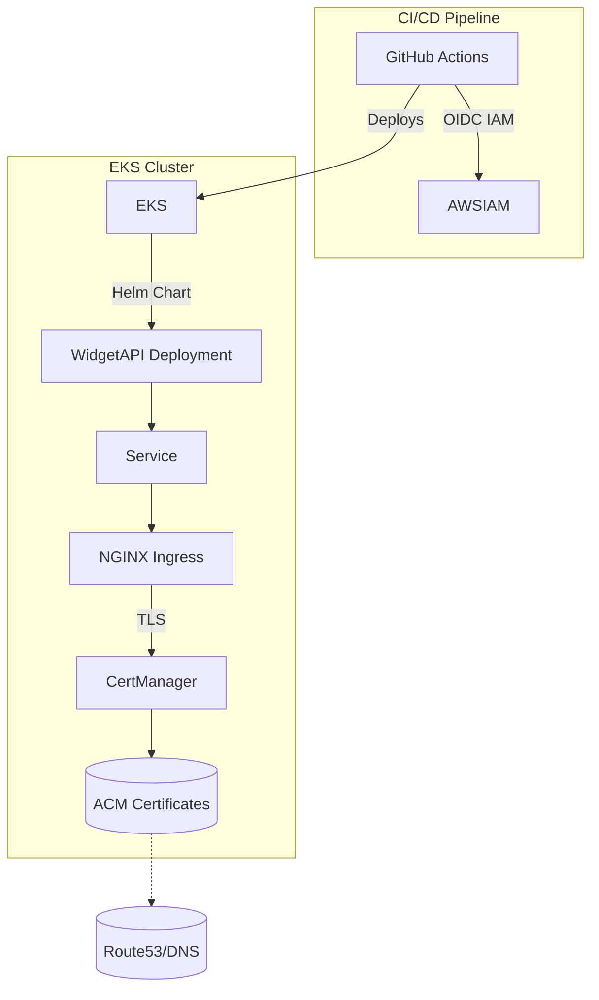

# 🌐 **WidgetAPI on AWS EKS with Helm, NGINX Ingress, Cert-Manager & GitHub Actions**

This project automates deployment, testing, and validation of **WidgetAPI** using:

- 🚀 **Helm** for Kubernetes packaging
- ☁️ **Amazon EKS** (Elastic Kubernetes Service)
- 🌐 **NGINX Ingress Controller** for routing
- 🔐 **Cert-Manager** for TLS certificates
- ⚙️ **GitHub Actions CI/CD** with OIDC IAM
- 🧪 **Helm tests** for application validation
- 🛡️ **Security scans** for Kubernetes workloads
- 🧰 **Local support** via Minikube or Kind

---

## 📦 Project Layout

```bash
.
├── chart/                      # Helm chart
│   ├── values.yaml
│   ├── dev-values.yaml
│   ├── stage-values.yaml
│   ├── prod-values.yaml
│   ├── local-values.yaml
│   ├── cluster-issuer.yaml
│   └── templates/
│       ├── ingress.yaml
│       ├── pvc.yaml
│       ├── deployment.yaml
│       ├── service.yaml
│       ├── tests/
│       │   ├── test-connection.yaml
│       │   ├── test-file-upload.yaml
│       │   └── test-readiness.yaml
├── scripts/
│   ├── setup-iam-pre-eks.sh
│   ├── setup-iam-post-eks.sh
│   ├── manage-eks.sh
│   ├── deploy.sh
│   ├── delete-eks.sh
│   ├── k8s-security-check.sh
│   └── setup-minikube-or-kind.sh
├── ci-env/                    # Environment variables
│   ├── dev.env
│   ├── stage.env
│   └── prod.env
├── iam/
│   ├── GitHubActionsPolicy.json.template
│   └── trust-policy.json.template
└── .github/workflows/
    └── deploy.yml
```

---

## ☁️ Environments Overview

| Environment | Namespace        | Ingress        | Platform     |
|-------------|------------------|----------------|--------------|
| `local`     | widgetapi-local  | NGINX          | Kind/Minikube |
| `dev`       | widgetapi-dev    | NGINX (TLS)    | AWS EKS      |
| `stage`     | widgetapi-stage  | NGINX (TLS)    | AWS EKS      |
| `prod`      | widgetapi-prod   | NGINX (TLS)    | AWS EKS      |

---

## 🛠️ Architecture Overview
- This could probably be better but provides overview...


---

## 🚀 Deployment Options

### 🧪 Local (Minikube or Kind)
```bash
scripts/setup-minikube-or-kind.sh -k  # Or use -m for Minikube
scripts/deploy.sh local
```

### ☁️ AWS EKS (Dev, Stage, Prod)
```bash
scripts/manage-eks.sh dev
scripts/deploy.sh dev
```

> Automatically provisions IAM roles, installs EBS CSI, NGINX Ingress, Cert-Manager, Cluster Autoscaler.

---

## 🔁 CI/CD via GitHub Actions

| Branch | Namespace        | Environment |
|--------|------------------|-------------|
| `dev`  | widgetapi-dev    | dev         |
| `stage` | widgetapi-stage   | stage        |
| `prod` | widgetapi-prod   | prod        |

GitHub Actions uses OIDC to authenticate and deploy:

```yaml
bash scripts/k8s-security-check.sh $NAMESPACE
```

✅ Secure, dynamic, namespace-scoped checks.

See: [.github/workflows/deploy.yml](.github/workflows/deploy.yml)


Here’s a markdown guide you can include in your `README.md` to document how to **manually trigger GitHub Actions** jobs using the `gh` CLI for the `widgetapi-dev` environment.

---

## 🧪 Manually Trigger GitHub Actions via CLI

To manually trigger a GitHub Actions deployment workflow for a specific environment (e.g. `dev` branch → `widgetapi-dev`), you can use the GitHub CLI (`gh`):

### 📦 Prerequisites

- Install the [GitHub CLI](https://cli.github.com/)
- Authenticate via `gh auth login`
- Ensure your local branch is `dev` or matches the environment you want to deploy

---

### 🚀 Run Deployment for `widgetapi-dev`

```bash
gh workflow run deploy.yml \
  --ref dev \
  --repo cmcconnell1/widgetapi \
  -f environment=widgetapi-dev
```

### 🧾 Example

```bash
gh workflow run deploy.yml \
  --ref dev \
  --repo cmcconnell1/widgetapi \
  -f environment=widgetapi-dev
```

This will trigger the GitHub Actions CI/CD pipeline for the `dev` branch and run the full deployment, Helm tests, and security scan on the `widgetapi-dev` namespace.

---

### 🔍 Check Workflow Run Status

To monitor the run:

```bash
gh run list --workflow=deploy.yml
gh run watch <run-id>
```

Or open it in the browser:

```bash
gh run view --web
```

---

✅ **Note:** The `environment` field (`-f environment=widgetapi-dev`) maps to the `environment:` block in `.github/workflows/deploy.yml`, which sets up the correct AWS EKS environment, namespace, and GitHub OIDC IAM role.

---

## 🔐 Security Checks

```bash
scripts/k8s-security-check.sh widgetapi-dev
```

✅ Includes:

- Pod/container privilege checks
- Run-as-root detection
- NetworkPolicy presence
- [Docker Scout](https://docs.docker.com/scout/)
- [Kubescape (optional)](https://kubescape.io/)

---

## 🧪 Helm Tests (Post-Deployment)

| Test                     | Purpose                               |
|--------------------------|----------------------------------------|
| `test-connection.yaml`   | Service DNS & connectivity             |
| `test-file-upload.yaml`  | File upload/download integration       |
| `test-readiness.yaml`    | App pod health check (K8s native)      |

Run manually:
```bash
helm test widgetapi -n widgetapi-dev
```

---

## ❌ Delete EKS Cluster (Cleanup)

```bash
scripts/delete-eks.sh dev
```

Deletes EKS cluster, volumes, and IAM roles safely.

---

## 📚 References

- 📘 [Helm Docs](https://helm.sh/docs/)
- 📘 [EKS User Guide](https://docs.aws.amazon.com/eks/latest/userguide/)
- 📘 [Cert-Manager Docs](https://cert-manager.io/docs/)
- 📘 [NGINX Ingress](https://kubernetes.github.io/ingress-nginx/)
- 📘 [GitHub Actions OIDC](https://docs.github.com/en/actions/deployment/security-hardening-your-deployments/about-security-hardening-with-openid-connect)

---

## 🧩 Contributing

1. Fork this repo
2. Create a branch
3. Push changes and open a PR

---

## 🛡️ License

This project is licensed under [MIT License](LICENSE)

---

## 🤝 Maintainers
Maintained by your-team-here...
